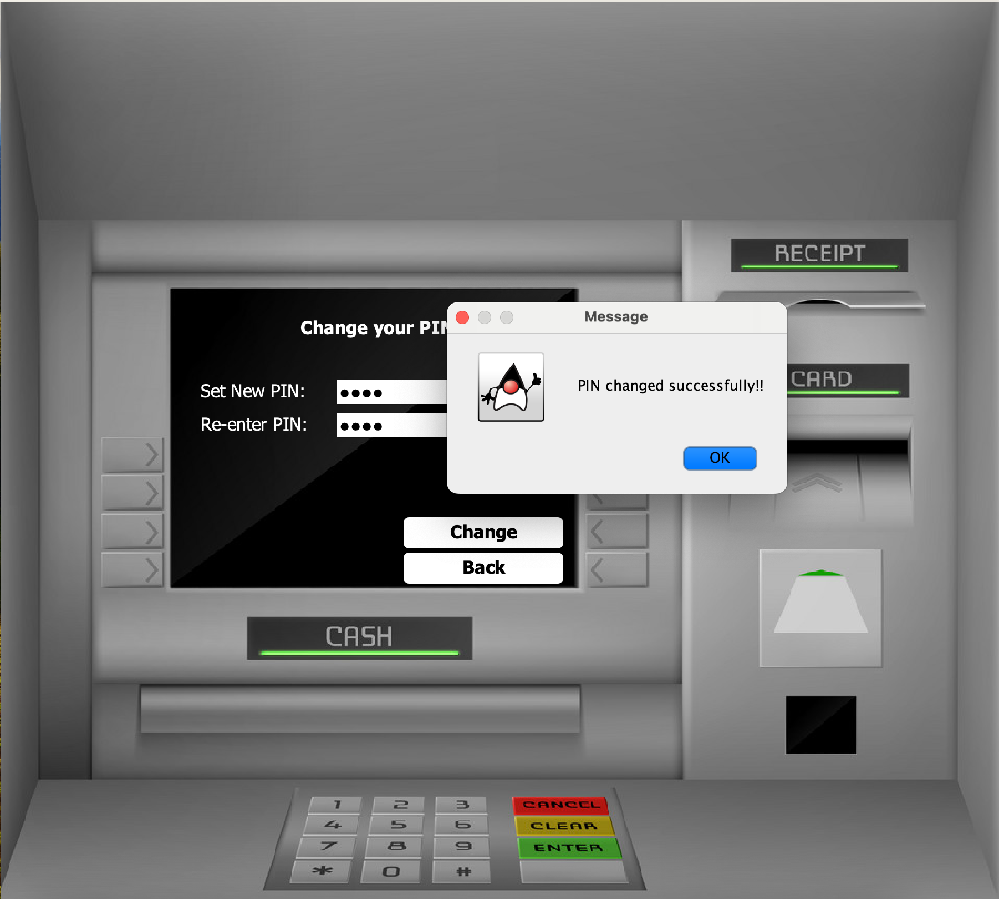

# ATM Simulator System
This Java-based project simulates an ATM system, allowing users to interact with a simulated bank account. Features include balance enquiry, money deposit/withdrawal, pin change, mini statement, with data stored in a MySQL database.

## Features -
- **Account Management**: Users can create accounts, check balance, manage personal information.
- **Transactions**: Users can perform cash withdrawals/deposits from/to their account. Fast cash option to withdraw money on-the-go.
- **Transaction history**: Mini statement service to track transaction details for auditing and tracking.
- **PIN verification/change**: Secure PIN access and PIN change service.
- **MySQL Database Integrations**: The system securely stores account details and transaction history in a MySQL database.

## Technologies/Concepts/Tools used -
- **GUI**: Java Swing library
- **Backend**: Java, JDBC
- **Database**: MySQL
- **Tools**: MySQL Workbench (RDBMS), Apache Netbeans (IDE)
- **Advanced concepts**:
  1. OOP concepts (encapsulation, abstraction, inheritance, polymorphism)
  2. Pre-compiled regex patterns (compile-once-use-multiple-time) for fast performance
  3. Robust form validations for necessarily clean data inputs
  4. try-with-resources block for seamless exception handling and to auto close DB connections and Prepared Statements avoiding memory leaks, enabling faster DB i/o operations
  5. PreparedStatements to avoid SQL injection attacks securely storing user data

## Screenshots - 

1. Login Screen


2. Signup - Page 3 (Generated card details)


3. Transactions screen


4. Pin Change screen



5. Money deposit screen


6. Fast cash options


7. Mini statement (Last 5 transactions made)


## Installation -
1. Clone the repository.
   ```bash
   git clone https://github.com/Gokul221/ATM-Simulator-Java-swing.git

2. Open this project in any IDE (Intellij IDEA, Eclipse, Apache Netbeans, etc).

3. Use the SQL file provided in the database folder to readily create necessary tables.

4. Run the Login.java class as it is an entry point in the application. Sign in/Sign up to proceed further.
